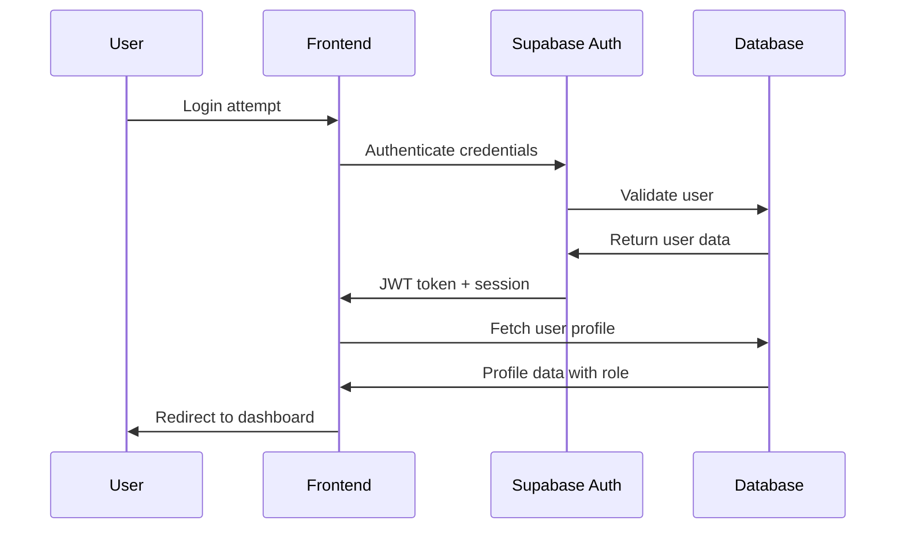

# Architecture Overview

This document provides a comprehensive overview of the Sika Shopping Cart Management System architecture.

## System Architecture

### High-Level Architecture

```
┌─────────────────┐    ┌─────────────────┐    ┌─────────────────┐
│   Frontend      │    │    Supabase     │    │   PostgreSQL    │
│   (React)       │◄──►│   (Backend)     │◄──►│   (Database)    │
│                 │    │                 │    │                 │
└─────────────────┘    └─────────────────┘    └─────────────────┘
```

### Technology Stack

#### Frontend Layer
- **React 18**: Component-based UI framework
- **TypeScript**: Type safety and developer experience
- **Vite**: Build tool and development server
- **Tailwind CSS**: Utility-first styling framework
- **Shadcn/UI**: Accessible component library

#### Backend Layer
- **Supabase**: Backend-as-a-Service platform
- **PostgreSQL**: Relational database
- **Row Level Security**: Database-level access control
- **Supabase Auth**: Authentication and user management

#### State Management
- **TanStack Query**: Server state management and caching
- **React Context**: Client state management (Auth)
- **React Hook Form**: Form state management

## Component Architecture

### Application Structure

```
src/
├── components/
│   ├── ui/              # Reusable UI components (Shadcn)
│   ├── AuthProvider.tsx # Authentication context
│   ├── Header.tsx       # Navigation header
│   └── ProtectedRoute.tsx # Route protection
├── pages/
│   ├── Auth.tsx         # Authentication page
│   ├── Dashboard.tsx    # Main dashboard
│   ├── RequestForm.tsx  # Request creation/editing
│   ├── RequestDetail.tsx # Request details view
│   └── Admin.tsx        # Admin panel
├── lib/
│   ├── supabase.ts      # Database helper functions
│   └── utils.ts         # Utility functions
├── integrations/
│   └── supabase/        # Auto-generated Supabase client
├── hooks/               # Custom React hooks
└── assets/              # Static assets
```

### Key Components

#### Authentication Flow
1. **AuthProvider**: Manages authentication state
2. **ProtectedRoute**: Route-level access control
3. **Auth**: Login/logout interface

#### Data Flow
1. **User Action** → Component Event Handler
2. **API Call** → Supabase Client
3. **Database Query** → PostgreSQL with RLS
4. **Response** → TanStack Query Cache
5. **UI Update** → React Component Re-render

## Database Architecture

### Entity Relationship

```
profiles (users)
    ├── shopping_requests (1:many)
    │   └── request_items (1:many)
    └── shopping_cart_items (1:many)
```

### Security Model

#### Row Level Security (RLS)
- **User Isolation**: Users can only access their own data
- **Role-based Access**: Different permissions for each role
- **Manager Hierarchy**: Managers see direct reports' requests
- **Procurement Access**: Procurement staff see all approved requests

#### User Roles
- **user**: Standard employees
- **manager**: Team leaders with approval rights
- **procurement**: Procurement team members
- **admin**: System administrators

## Authentication & Authorization

### Authentication Flow



### Authorization Levels

1. **Route Level**: ProtectedRoute component
2. **Component Level**: Conditional rendering based on role
3. **Database Level**: RLS policies enforce data access
4. **API Level**: Supabase client with user context

## Data Management

### State Management Strategy

#### Server State (TanStack Query)
- API data fetching and caching
- Background synchronization
- Optimistic updates
- Error handling and retries

#### Client State (React Context)
- Authentication state
- User profile information
- Global UI state

#### Form State (React Hook Form)
- Form validation with Zod schemas
- Real-time validation feedback
- Optimized re-rendering

### Caching Strategy

- **Query Caching**: Automatic caching of API responses
- **Background Refetch**: Keep data fresh
- **Optimistic Updates**: Immediate UI feedback
- **Cache Invalidation**: Smart cache updates

## Security Architecture

### Frontend Security
- **Type Safety**: TypeScript prevents common errors
- **Input Validation**: Zod schemas validate all inputs
- **XSS Protection**: React's built-in XSS protection
- **Route Protection**: Authentication required for all routes

### Backend Security
- **Row Level Security**: Database-enforced access control
- **SQL Injection Prevention**: Parameterized queries
- **Authentication**: JWT-based session management
- **HTTPS**: Secure communication

### Data Security
- **Encrypted Storage**: Supabase handles encryption
- **Backup Strategy**: Automated backups
- **Access Logging**: Audit trail for data access
- **Role-based Permissions**: Least privilege principle

## Performance Considerations

### Frontend Optimization
- **Code Splitting**: Lazy loading of routes
- **Tree Shaking**: Unused code elimination
- **Bundle Optimization**: Vite's efficient bundling
- **Image Optimization**: Optimized asset loading

### Backend Optimization
- **Query Optimization**: Efficient database queries
- **Connection Pooling**: Database connection management
- **Caching**: Multiple layers of caching
- **CDN**: Static asset delivery

### Scalability
- **Horizontal Scaling**: Supabase auto-scaling
- **Database Optimization**: Indexed queries
- **Client-side Caching**: Reduced server load
- **Efficient Updates**: Optimistic UI updates

## Integration Points

### External Services
- **Supabase**: Primary backend service
- **PDF Generation**: jsPDF for report creation
- **Email**: (Future) Notification system
- **File Storage**: (Future) Document management

### API Design
- **RESTful**: Supabase REST API
- **Real-time**: Supabase real-time subscriptions
- **GraphQL**: (Future) Advanced querying
- **Webhooks**: (Future) External integrations

---

This architecture ensures a scalable, secure, and maintainable application that can grow with organizational needs while maintaining performance and reliability.